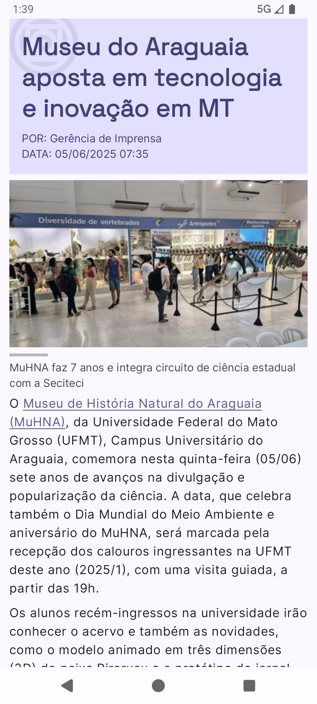
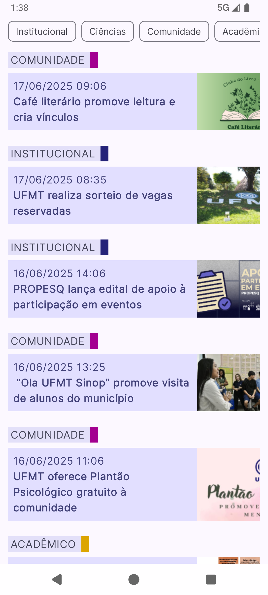

## UfmtNews

Este projeto consiste em uma aplicação mobile que consome dados da API do portal da UFMT. O objetivo principal é demonstrar técnicas de renderização de conteúdo HTML dinâmico em aplicações Android nativas.

## Funcionalidades

- Listagem paginada de notícias
- Filtragem por categorias
- Visualização detalhada com renderização HTML nativa

<table>
  <tr>
    <td></td>
    <td></td>
  </tr>
</table>